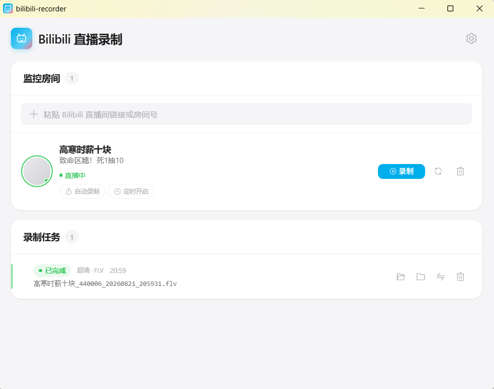

<div align="center">

# Bilibili 直播录制工具

**一款简洁、可靠的 Bilibili 直播录制桌面工具**

房间监控 · 手动与自动录制 · 每日定时 · FLV/MKV 转 MP4 · 多画质与多编码


</div>

## 功能

- 添加数字房间号、`live.bilibili.com` 地址或指向直播间的 `b23.tv` 分享链接
- 自动把短房间号转换为真实房间号并保存主播、标题、封面和头像
- 手动开始与停止录制；未开播或轮播时不会创建无效任务
- 为单个房间开启自动监控，检测到真实直播后自动开始录制
- 设置每天固定时间开启一个自动监控窗口
- 原画、蓝光、超清、高清、流畅画质；不可用时选择官方返回的最接近画质
- 自动或手动选择 AVC、HEVC、AV1 编码；自动模式优先实际画质
- 记录请求画质、实际画质、编码、流类型和录制容器
- FFmpeg 多 CDN 启动探测、有限重连和异常结束识别
- AVC 直流录制为 FLV，HEVC/AV1 与 HLS-fMP4 录制为 MKV
- 手动或自动将 FLV/MKV 无损封装为 MP4，并可选择是否保留源文件
- HTTP 代理、可选浏览器 Cookie、本地 SQLite 数据库存储

> 本工具只录制 Bilibili 的真实直播状态。轮播内容不会触发手动或自动录制。

## 截图



## 使用方法

1. 启动应用，在“监控房间”输入框粘贴直播间链接或输入数字房间号。
2. 点击“添加”，等待房间信息出现在列表中。
3. 主播显示“直播中”时点击“录制”。
4. 停止或自然下播后，可在任务列表打开文件、定位目录或转换为 MP4。

也可以为房间开启“自动录制”，或设置“每天 HH:mm”定时开启。自动监控只在设定窗口内请求状态，录制期间不会重复轮询。

默认录制目录为用户目录下的 `BilibiliRecordings`。

## 设置

| 设置项 | 说明 | 默认值 |
|---|---|---|
| 代理地址 | HTTP/HTTPS 代理，例如 `http://127.0.0.1:7890` | 空 |
| Cookie | 浏览器 Cookie；可能获得登录用户可用的画质 | 空 |
| 画质偏好 | 原画 / 蓝光 / 超清 / 高清 / 流畅 | 原画 |
| 视频编码 | 自动 / AVC / HEVC / AV1；自动模式先比较实际画质 | 自动 |
| 录制目录 | FLV、MKV 和 MP4 的保存位置 | `~/BilibiliRecordings` |
| 自动转 MP4 | 录制正常完成后自动转换 | 关闭 |
| 保留原始录制文件 | MP4 成功后是否保留源文件 | 开启 |
| 时间格式 | 实际日期或相对时间，12/24 小时制 | 实际日期、24 小时 |
| 开播检测间隔 | 自动录制状态检查间隔 | 60 秒 |
| 单次监控窗口 | 到期仍未开播时停止请求 | 6 小时 |
| 自动录完一场后 | 关闭自动录制或继续下一窗口 | 关闭自动录制 |
| 数据库位置 | SQLite 数据库文件 | `~/.bilibili-recorder/bilibili_recorder.db` |

### Cookie 安全提示

Cookie 会以明文保存在当前用户的 `~/.bilibili-recorder/settings.json`。请只在可信设备使用，不要分享设置文件或截图。Cookie 无效或未登录时，Bilibili 可能自动降低实际画质。

## 录制状态

- **准备中**：正在解析播放流并探测 CDN，只有文件产生有效数据后才进入录制中。
- **录制中**：FFmpeg 正在写入与所选编码兼容的 FLV 或 MKV。
- **结束处理中**：正在确认下播状态、统计文件或转换 MP4。
- **已完成**：手动停止，或 FFmpeg 结束后确认主播已经下播。
- **录制中断**：FFmpeg 已退出，但主播仍在真实直播。
- **失败**：所有 CDN 均无法产生有效数据，或最终文件为空。

## 开发

### 技术栈

| 层级 | 技术 |
|---|---|
| 前端 | Vue 3、TypeScript、Element Plus、Pinia |
| 桌面框架 | Tauri 2 |
| 后端 | Rust、Tokio、Reqwest |
| 数据库 | SQLite / rusqlite |
| 录制引擎 | FFmpeg sidecar |
| 构建工具 | Vite 6、pnpm |

### 环境要求

- Windows 10/11 x64
- Node.js 18 或更新版本
- pnpm
- Rust stable MSVC 工具链
- FFmpeg Windows x64 构建

### FFmpeg

把 FFmpeg 放入：

```text
src-tauri/binaries/ffmpeg-x86_64-pc-windows-msvc.exe
```

该文件体积较大，已在 `.gitignore` 中排除。应用打包时会把它作为 Tauri sidecar 一并包含。

### 安装依赖与运行

```bash
pnpm install
pnpm tauri dev
```

### 测试与构建

```bash
cd src-tauri
cargo test
cd ..
pnpm build
pnpm tauri build
```

Windows 安装包输出到 `src-tauri/target/release/bundle/`。

## 数据和文件行为

- 房间与任务记录保存在本地 SQLite 数据库。
- 删除任务只删除数据库记录，不会删除录制文件。
- 打开文件和定位目录只允许访问当前录制目录下、数据库任务所引用的文件。
- 修改数据库位置会从当前正在使用的数据库复制，而不是固定从默认路径复制。
- MP4 转换先写临时文件并验证成功，再完成改名和可选的源文件删除。

## 许可证

[MIT](LICENSE)

本项目使用 FFmpeg 作为独立录制进程，详见 [第三方许可证声明](THIRD_PARTY_LICENSES.md)。
